## Introduction/Background
Exoplanets are defined as planets that exist outside of our solar system. Some exoplanets have characteristics that make them more suitable for life than others. In the paper, “Habitability Classification of Exoplanets: A Machine Learning Insight”, Basak et. al. use various machine learning techniques to classify exoplanets from the PHL-EC dataset based on habitability to explore the limitations and suitability of different techniques. They found random forest, decision trees, and XGBoost performed the best in categorization. To explore this insight, we will use a dataset from the NASA Exoplanet Archive that categorized over 4000 unique exoplanets.
Here is the dataset: [kaggle.com/datasets/chandrimad31/phl-exoplanet-catalog](https://www.kaggle.com/datasets/chandrimad31/phl-exoplanet-catalog)

## Problem Statement
Analysis on the data of these exoplanets is difficult and expensive as scientists have found thousands of exoplanets over the years with tons of data on them without a streamlined method to determine habitability on this data. Using PCA and KNN, we can aid in the determination of whether a given exoplanet is more likely to be habitable.

## Methods
Due to the high dimensionality dataset, it may be beneficial to reduce dimensionality to focus on the most significant features and reduce overfitting. To achieve this, we can use Principal Component Analysis (PCA) to determine which principal components to keep based on correlations of the features.

Another approach using collaborative filtering is to implement the KNN algorithm to find similar instances and replace missing values based on the values of the nearest neighbors. This approach is more implementation heavy, and will be reserved for a smaller set of features with missing values after using other preprocessing methods. Additionally, many features have very different scales ranging from decimal differences to thousands. Therefore, we will need to scale the data’s features through min-max scaling or z-score standardization to ensure optimal model performance.

Since habitability is a binary classification problem and the labels are provided in the dataset, we are working in a supervised learning setting which means we will need to segment our data into training and testing examples. It is important that we include enough cases of habitable planets in our each set due to the class imbalance.

Basak et. al. demonstrated the notable performance of tree-based methods such as decision trees, random forests, and gradient boosted trees on the PHL-EC dataset. Following this notion, we plan to implement all three tree-based algorithms, specifically using scikit-learn or XGBoost library for our ordinary decision tree and random forest models, and the XGBoost library for our gradient boosted model.

Similarly, support vector machines are effective in high dimensional spaces like our dataset, and this idea is accurately reflected by the strong SVM performance from Agrawal et. al. As such, we will implement the scikit-learn SVM model. 

## Data Processing Methods

### SMOTE (Synthetic Minority Oversampling Technique)
The purpose of SMOTE is to address class imbalance by generating synthetic samples for the minority class. It first locates nearest neighbors for each sample in the minority class, then creates synthetic samples by interpolating between existing minority class samples and their neighbors. SMOTE works well with our dataset because our current dataset exhibited a significant imbalance between minority and majority classes, i.e. “habitable” and “inhabitable” planets. After implementing SMOTE, our classifier performance is improved by balancing the dataset, leading to improved recall and F1 scores. 

### KNN (K-Nearest Neighbors)
KNN works by identifying the 'k' closest data points (neighbors) to a given input based on a distance metric, such as Euclidean distance. The algorithm then predicts the output by averaging the values (in regression) or taking a majority vote among the neighbors (in classification). KNN worked well with our dataset as we can see the example imputed data distribution for the feature P_RADIUS, P_RADIUS_ERROR_MIN, and P_RADIUS_ERROR_MAX. 

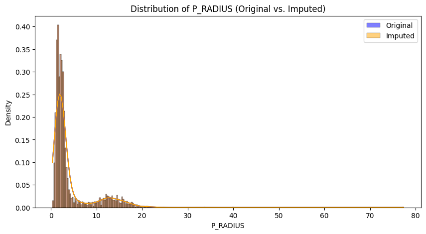
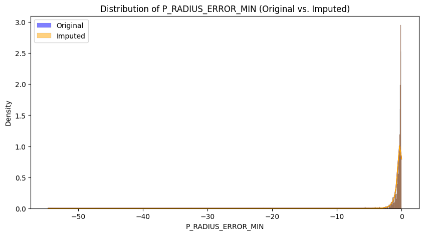
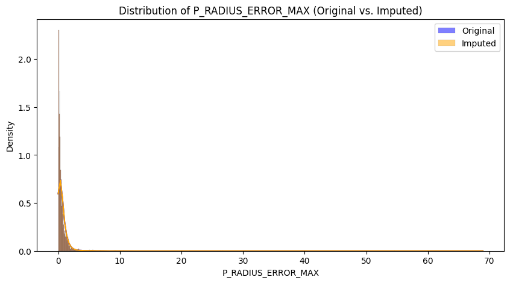

### PCA (Principal Component Analysis)

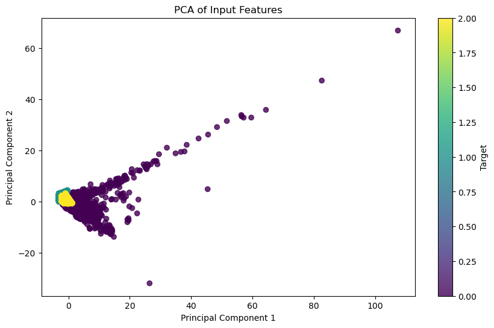
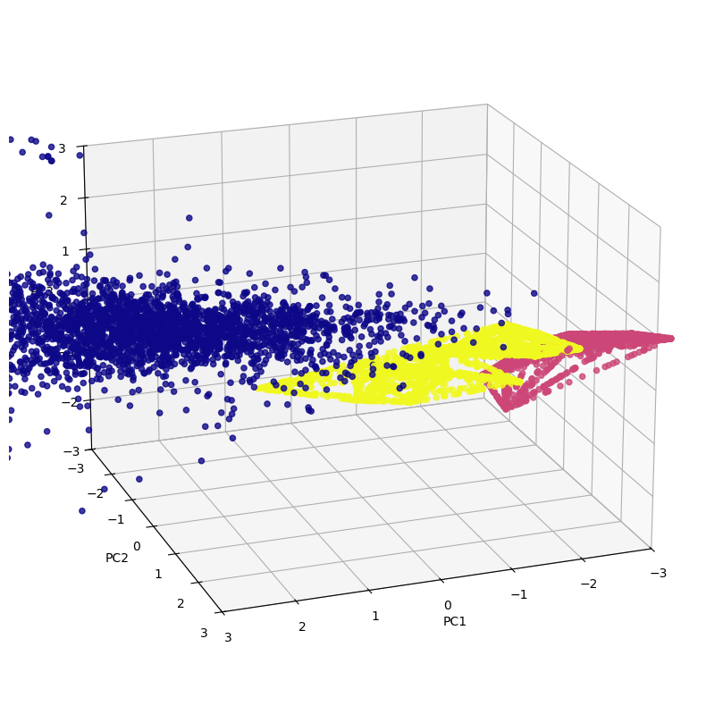

These two visualizations are for PCA. They show how PCA was efficient in reducing the dimensionality of the dataset and was able to capture the variance in certain principal components. 

## ML Models
This table shows the performance of each model. 

| Model     | Accuracy| Precision| Recall| F1 Score|
|:----------|:-------|:--------|:------|:-------|
| XGBoost | 0.995 | 0.996 | 0.995 | 0.995 |
| SVM | 0.988 | 0.992 | 0.988 | 0.989 |
| Random Forest | 0.995 | 0.891 | 0.932 | 0.910 |
| Neural Network | 0.985 | 0.991 | 0.985 | 0.987 |

### XGBoost
Our XGBoost model’s accuracy was initially 1.0, which was misleading due to the imbalanced dataset. However after implementing a data augmentation method (SMOTE) the accuracy came down to a 0.9951 which is still high but still shows the impact of using a balanced and well-prepared dataset.

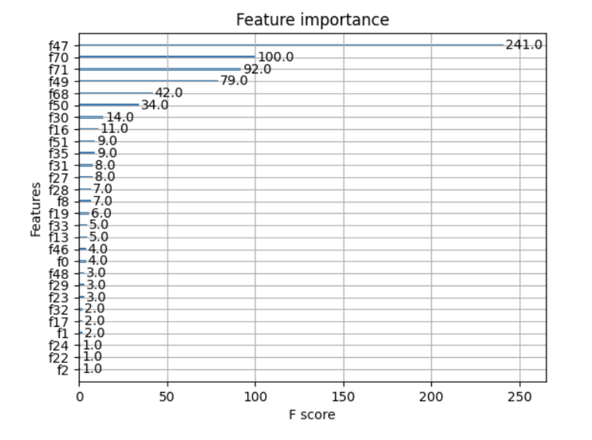

This is the old plot for XGBoost identifying which features contribute most to the predictions for habitable or non-habitable planets. The figure shows that features,  "f47," "f70," "f71," and "f49," have very high importance scores compared to the others which means that they are influential when making predictions. Specifically, “f47” has a score of 241, implying that it was very influential. This could explain our overfitting in which the model mostly focuses on these features and doesn’t learn the broader patterns. Balancing the feature importance could improve the model’s ability to generalize to unseen data.

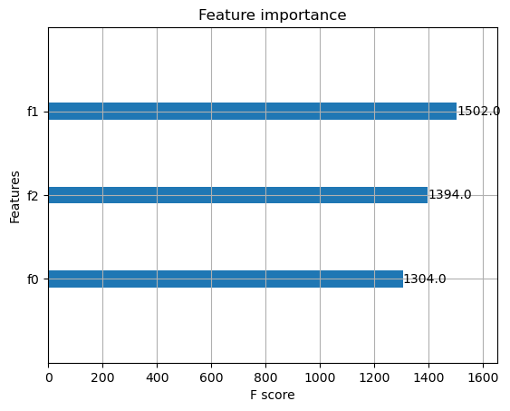

This is the new plot for XGBoost showing a more balanced feature importance compared to the old plot, demonstrating a more even distribution of importance among the features. The old plot features "f47," "f70," "f71," and "f49" had an extremely high importance, which is not present in this new plot. This indicates that the model is now considering a broader range of features when making predictions, which is a positive development. 

### SVM
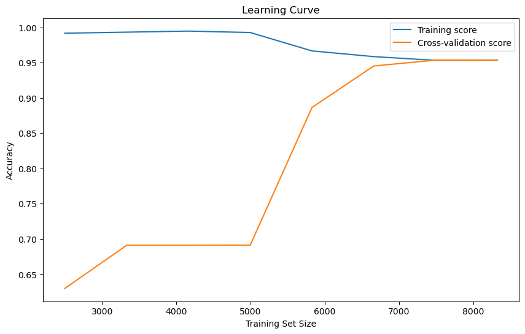

This is a plot measuring the accuracy of the training data compared to the validation data on the data trained using SVM with data augmentation using SMOTE. It’s clear from the graph that the data is not overfitting with SMOTE. As the training set size increases, the training score approaches the validation score at a high accuracy meaning that the model is not overfitting to the training data.

### Random Forest
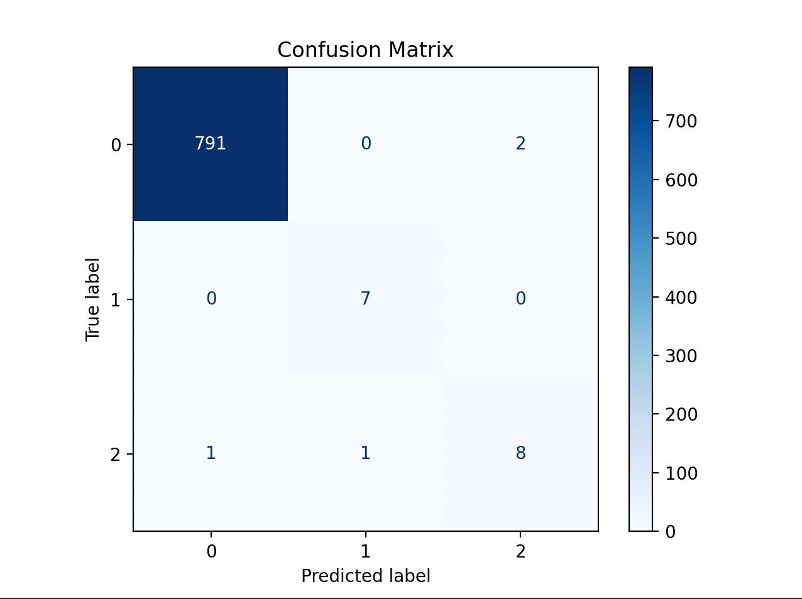

This is the confusion matrix for the Random Forest Model. This shows that class 0 is the majority class and there are 2 misclassifications. Class 1 is a minority class and has no misclassifications. Class 2 is also a minority class and has 2 misclassifications. The model performs really well for class 0 and 1 and only has minimal errors for class 2. This indicates that the model is accurately classifying planets as habitable or inhabitable. 

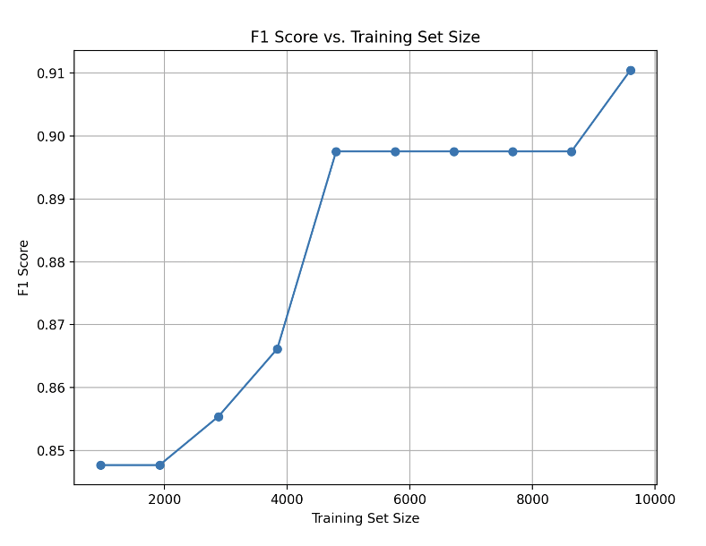

This is a learning curve plot for the Random Forest model. The plot shows that the F1 Score increases as the size of the training dataset increases. The F1 Score starts around .85 for smaller sets of around 2000 samples. Around 4500 to 8500 samples the F1 Score stabilizes around .90. When the dataset reaches around 10,000 samples, the F1 Score becomes .91. This shows that Random Forest is learning from the data and performs well with a large dataset. 

### Neural Network
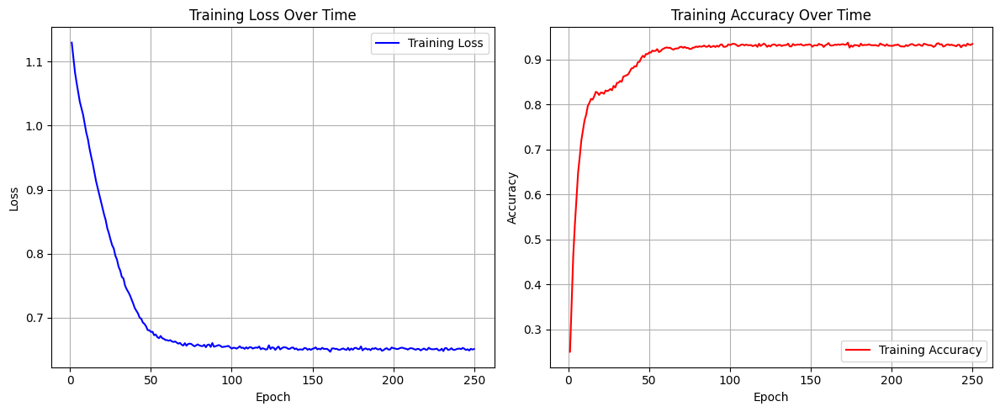

This visual shows two key training metrics for our Neural Net model trained on the exoplanet habitability classification task. These plots track its performance over 250 training epochs. The left plot shows the training loss overtime, measuring the model's prediction error over the training process. The loss curve begins at around 1.15 and shows a sharp decline within the first 50 epochs and then plateaus at around 0.65. The initial rapid decline indicates that the model is learning efficiently and the plateau suggests that the model reached a stable stage of optimization. The right plot shows the training accuracy over time. This metric represents the proportion of correct predictions the model made. The model starts off with a low training accuracy but has a sharp increase within the first 50 epochs and then plateaus at around 0.95. Both curves are relatively smooth, indicating well tuned hyperparameters and stable learning dynamics.   

## Results and Discussions
XGBoost is a supervised machine learning algorithm, which uses an ensemble of multiple decision trees to create a predictive model. Initially we found that our predictive model had an impossibly high accuracy of 1.0 when applied with the exoplanets dataset. We realized that the dataset contains a smaller number of habitable exoplanets as compared to non-habitable exoplanets. This meant it had an imbalancing effect on the dataset. The model was more likely to overfit the larger proportion of the class with non-habitable exoplanets. We would have to equalize the number of instances present in this imbalanced dataset, so we started implementing SMOTE to provide new points in the minority class. However, SMOTE kept the accuracy unchanged. Although we applied SMOTE to balance the dataset, the model might still be overfitting because of the high importance of a few dominant features. The model might be memorizing the patterns in the training data, leading to a perfect accuracy on both training and test sets. We plan on implementing several steps next to improve the model’s performance and address the perfect accuracy issue. The feature importance plot shows that a few features, such as “f47”, “f70”, and “f71”, dominate the model’s predictions, confirming overfitting. We will consider removing or transforming these features to reduce the impact they have on the mode. Although PCA has already been implemented it did not fully mitigate overfitting. We will experiment with different numbers of principal components to further reduce feature dominance while keeping important information. 

SVM is a supervised machine learning algorithm that works well for classification tasks by finding a hyperplane that best separates data points from different classes. When we first applied SVM to our habitable exoplanets dataset, we achieved a really high accuracy of 98%. However, we looked at the model predictions and saw that every planet was being classified as non-habitable. We realized that this was the case because our dataset was imbalanced because there are significantly more negative (non-habitable) examples than positive (habitable) ones. We realized we needed to add more examples to our minority class to balance the dataset, so we implemented Synthetic Minority Over-sampling Technique (SMOTE). The way SMOTE works is by creating synthetic examples of the minority class. Using this method, our accuracy changed to 75%. While this is a good start, we want to do future tuning and exploration of alternative data augmentation approaches to find what best handles the imbalanced dataset. 

Random Forest is a machine learning algorithm that is helpful to use for classification. It works by building multiple decision trees using random sampling with replacements and random subsets of features at each split. Specifically for classification, it uses majority voting across trees. Implementing this model, we achieved an accuracy of .995, a precision of .891, and a F1 Score of .910. Considering the accuracy by itself can be misleading especially since this is an imbalance dataset where one class dominates. However, the precision and F1 Score suggest that the model is actually learning and has a good balance between precision and recall. The confusion matrix shows that the model struggles with the minority classes, but overall the number of misclassifications aren’t significant. A next step for this model could include gathering or creating more data for the minority classes.

Neural nets are powerful supervised learning models that are most suitable for tasks with complex and nonlinear relationships. The Neural network implemented for this project was implemented with multiple fully connected layers with activation functions to earn complex relationships in the dataset. Its high training accuracy indicates that it effectively used the available features to model the habitability classification task. The non-regularized model had an accuracy of 96.30% while the regularized one had an accuracy of 98.27%. Regularization introduces a bias-variance trade off, where a higher bias leads to a lower variance. In this case the regularized model shows that prioritizing generalization gives a more robust and reliable model which is better for practical applications. 

## Next Steps
For future efforts we would focus on further optimizing the feature selection and transformation to improve model generalization. We will explore more data augmentation methods aside from SMOTE, such as Adaptive Synthetic Sampling (ADASYN) for more diverse and realistic samples in the minority class to prevent the model from overfitting to the majority class. We also plan to perform hyperparameter tuning for all models to optimize performance and reduce bias-variance trade-offs. We would use techniques such as grid search and bayesian optimization to find the best configurations. For the Neural Net we will experiment with different architectures, activation functions, and regularization techniques to make it more robust and adaptable to complex dataset patterns. 

## References
1. S. Basak, A. Mathur, A. J. Theophilus, G. Deshpande, and J. Murthy, “Habitability classification of exoplanets: A machine learning insight - the European physical journal Special topics,” SpringerLink, https://link.springer.com/article/10.1140/epjs/s11734-021-00203-z (accessed Oct. 4, 2024).
2. “Importance of feature scaling,” scikit-learn, https://scikit-learn.org/stable/auto_examples/preprocessing/plot_scaling_importance.html (accessed Oct. 4, 2024).
3. “Neural networks,” Neural Networks - PyTorch Tutorials 2.4.0+cu121 documentation, https://pytorch.org/tutorials/beginner/blitz/neural_networks_tutorial.html (accessed Oct. 4, 2024).
4. “Support Vector Machines,” scikit-learn, https://scikit-learn.org/stable/modules/svm.html (accessed Oct. 4, 2024).
5. “KNN,” scikit-learn, https://scikit-learn.org/stable/modules/neighbors.html (accessed Oct. 4, 2024).
6. “PCA,” scikit-learn, https://scikit-learn.org/stable/modules/generated/sklearn.decomposition.PCA.html (accessed Oct. 4, 2024). 

## Contribution Table

| Name      | Contribution                                                |
|:----------|:------------------------------------------------------------|
| Varsha    |Results and Discussions, Random Forest|
| Harshitha |XGBoost, Final Report + Slides|
| Muchen    |PCA, Final Report + Slides, Github pages|
| Sam       |SVM, Introduction/Background|
| Josh      |Data cleaning, KNN, NN, Proposal Presentation|

## Gantt Chart
[Link to Gantt Chart.](./Exoplanet-Gantt-Chart.pdf)