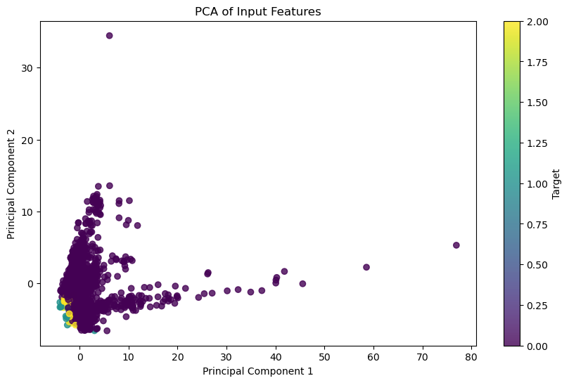
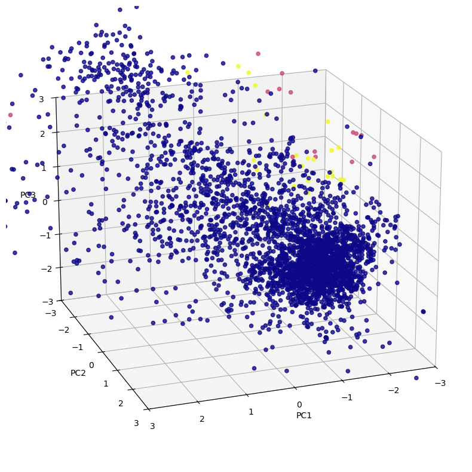
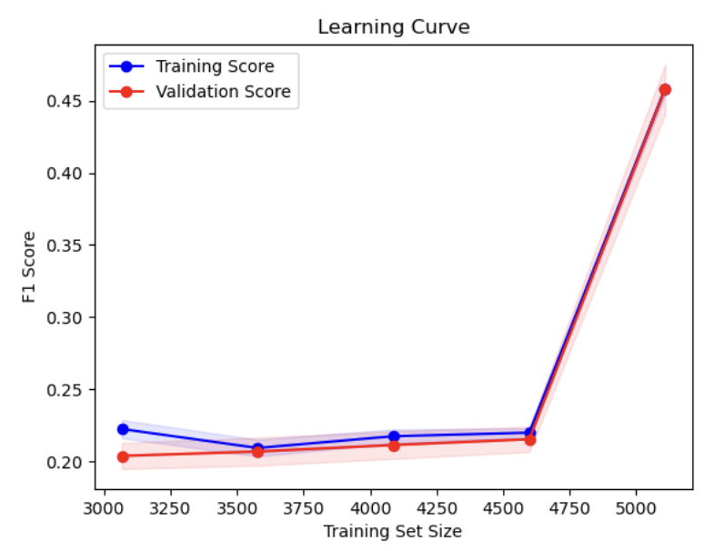
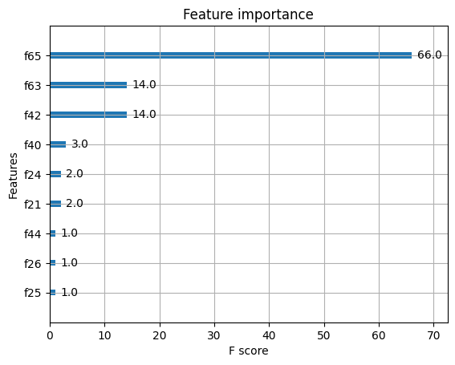
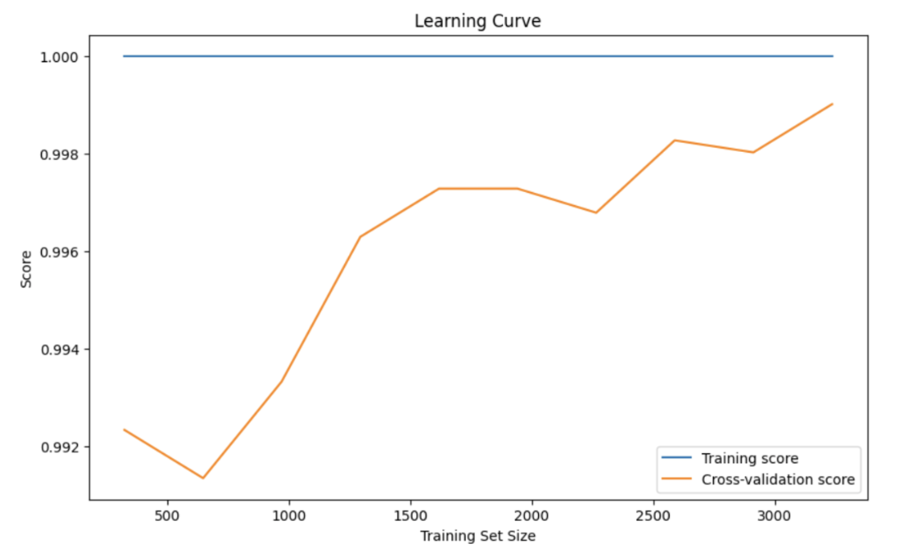

## Background
Exoplanets are defined as planets that exist outside of our solar system. Some exoplanets have characteristics that make them more suitable for life than others. In the paper, “Habitability Classification of Exoplanets: A Machine Learning Insight”, Basak et. al. use various machine learning techniques to classify exoplanets from the PHL-EC dataset based on habitability to explore the limitations and suitability of different techniques. They found random forest, decision trees, and XGBoost performed the best in categorization. To explore this insight, we will use a dataset from the NASA Exoplanet Archive that categorized over 4000 unique exoplanets.
Here is the dataset: [kaggle.com/datasets/chandrimad31/phl-exoplanet-catalog](https://www.kaggle.com/datasets/chandrimad31/phl-exoplanet-catalog)

## Problem Statement
Analysis on the data of these exoplanets is difficult and expensive as scientists have found thousands of exoplanets over the years with tons of data on them without a streamlined method to determine habitability on this data. Using PCA and KNN, we can aid in the determination of whether a given exoplanet is more likely to be habitable.

## Methods
Due to the high dimensionality dataset, it may be beneficial to reduce dimensionality to focus on the most significant features and reduce overfitting. To achieve this, we can use Principal Component Analysis (PCA) to determine which principal components to keep based on correlations of the features.

Another approach using collaborative filtering is to implement the KNN algorithm to find similar instances and replace missing values based on the values of the nearest neighbors. This approach is more implementation heavy, and will be reserved for a smaller set of features with missing values after using other preprocessing methods. Additionally, many features have very different scales ranging from decimal differences to thousands. Therefore, we will need to scale the data’s features through min-max scaling or z-score standardization to ensure optimal model performance.

Since habitability is a binary classification problem and the labels are provided in the dataset, we are working in a supervised learning setting which means we will need to segment our data into training and testing examples. It is important that we include enough cases of habitable planets in our each set due to the class imbalance.

Basak et. al. demonstrated the notable performance of tree-based methods such as decision trees, random forests, and gradient boosted trees on the PHL-EC dataset. Following this notion, we plan to implement all three tree-based algorithms, specifically using scikit-learn or XGBoost library for our ordinary decision tree and random forest models, and the XGBoost library for our gradient boosted model.

Similarly, support vector machines are effective in high dimensional spaces like our dataset, and this idea is accurately reflected by the strong SVM performance from Agrawal et. al. As such, we will implement the scikit-learn SVM model. 

## Results and Discussion
### Visualizations

These two visualizations are for PCA. They show how PCA was efficient in reducing the dimensionality of the dataset and was able to capture the variance in certain principal components. However, the visualizations show that there isn’t a clear separation or boundary between the habitable and non-habitable planets. Ideally, there would be distinct clusters, so this shows us that PCA alone won’t be enough to really distinguish between the classes. 

### Metrics
XGBoost Accuracy: 1.0

SVM Accuracy: .75

These accuracies are misleading due to the imbalanced dataset. SVM’s accuracy is less misleading due to our implementation of a data augmentation method (SMOTE) that improved the imbalance in our dataset. 

This is a plot measuring the F1 scores of the training data compared to the validation data on the data trained using SVM with data augmentation using SMOTE. It’s clear from the graph that the data is not overfitting with SMOTE as the training score matches with the validation score for all values in the training set.

This plot for XGBoost identifies which features contribute most to the predictions for habitable or non-habitable planets. The figure shows that features,  "f47," "f70," "f71," and "f49," have very high importance scores compared to the others which means that they are influential when making predictions. Specifically, “f47” has a score of 241, implying that it was very influential. This could explain our overfitting in which the model mostly focuses on these features and doesn’t learn the broader patterns. Balancing the feature importance could improve the model’s ability to generalize to unseen data.

The learning curve plot for the XGBoost model shows the relationship between the training set size and the model’s performance. The training score is consistently one across all training set sizes. This indicates overfitting, meaning the model has learned the training data too well and might not generalize well to unseen data. The orange line, which is the cross-validation score, is slightly lower when trained on a smaller subset of the data but then gradually improves as the training set size increases. Although the cross-validation score is high there is still a gap between the training score and cross-validation score further confirming that while the model performs well on unseen data it is still overfitting. 

### Analysis
XGBoost is a supervised machine learning algorithm, which uses an ensemble of multiple decision trees to create a predictive model. Initially we found that our predictive model had an impossibly high accuracy of 1.0 when applied with the exoplanets dataset. We realized that the dataset contains a smaller number of habitable exoplanets as compared to non-habitable exoplanets. This meant it had an imbalancing effect on the dataset. The model was more likely to overfit the larger proportion of the class with non-habitable exoplanets. We would have to equalize the number of instances present in this imbalanced dataset, so we started implementing SMOTE to provide new points in the minority class. However, SMOTE kept the accuracy unchanged. Although we applied SMOTE to balance the dataset, the model might still be overfitting because of the high importance of a few dominant features. The model might be memorizing the patterns in the training data, leading to a perfect accuracy on both training and test sets. We plan on implementing several steps next to improve the model’s performance and address the perfect accuracy issue. The feature importance plot shows that a few features, such as “f47”, “f70”, and “f71”, dominate the model’s predictions, confirming overfitting. We will consider removing or transforming these features to reduce the impact they have on the mode. Although PCA has already been implemented it did not fully mitigate overfitting. We will experiment with different numbers of principal components to further reduce feature dominance while keeping important information. 

SVM is a supervised machine learning algorithm that works well for classification tasks by finding a hyperplane that best separates data points from different classes. When we first applied SVM to our habitable exoplanets dataset, we achieved a really high accuracy of 98%. However, we looked at the model predictions and saw that every planet was being classified as non-habitable. We realized that this was the case because our dataset was imbalanced because there are significantly more negative (non-habitable) examples than positive (habitable) ones. We realized we needed to add more examples to our minority class to balance the dataset, so we implemented Synthetic Minority Over-sampling Technique (SMOTE). The way SMOTE works is by creating synthetic examples of the minority class. Using this method, our accuracy changed to 75%. While this is a good start, we want to do future tuning and exploration of alternative data augmentation approaches to find what best handles the imbalanced dataset. 

### Next Steps
As for next steps, we want to first address the imbalance in our dataset and overfitting in both XGBoost and SVM. We want to focus on adjusting feature selection and really choosing the right principal components in our PCA. Currently, the dominant features are leading to overfitting. Although we used a data augmentation method (SMOTE) to combat the imbalance, it didn’t fully mitigate the overfitting, so we will look at alternative data augmentation methods to combat the overfitting we are seeing. Once we work through this, we will look to explore implementing a Multilayer Perceptron to test a neural network's ability to capture complex patterns

## References
1. S. Basak, A. Mathur, A. J. Theophilus, G. Deshpande, and J. Murthy, “Habitability classification of exoplanets: A machine learning insight - the European physical journal Special topics,” SpringerLink, https://link.springer.com/article/10.1140/epjs/s11734-021-00203-z (accessed Oct. 4, 2024).
2. “Importance of feature scaling,” scikit-learn, https://scikit-learn.org/stable/auto_examples/preprocessing/plot_scaling_importance.html (accessed Oct. 4, 2024).
3. “Neural networks,” Neural Networks - PyTorch Tutorials 2.4.0+cu121 documentation, https://pytorch.org/tutorials/beginner/blitz/neural_networks_tutorial.html (accessed Oct. 4, 2024).
4. “Support Vector Machines,” scikit-learn, https://scikit-learn.org/stable/modules/svm.html (accessed Oct. 4, 2024).
5. “KNN,” scikit-learn, https://scikit-learn.org/stable/modules/neighbors.html (accessed Oct. 4, 2024).
6. “PCA,” scikit-learn, https://scikit-learn.org/stable/modules/generated/sklearn.decomposition.PCA.html (accessed Oct. 4, 2024). 

## Contribution Table

| Name      | Contribution                                                |
|:----------|:------------------------------------------------------------|
| Varsha    |Results and Discussions     |
| Harshitha |XGBoost     |
| Muchen    |PCA     |
| Sam       |SVM    |
| Josh      |Data cleaning and KNN   |

## Gantt Chart
[Link to Gantt Chart.](./Exoplanet-Gantt-Chart.pdf)